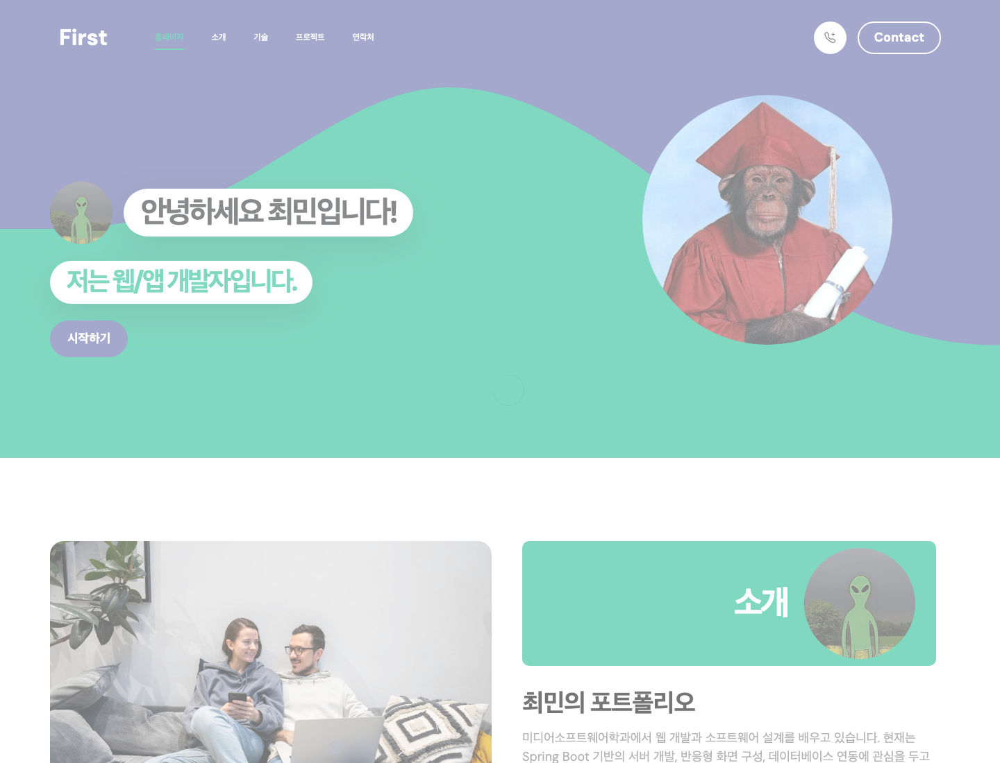
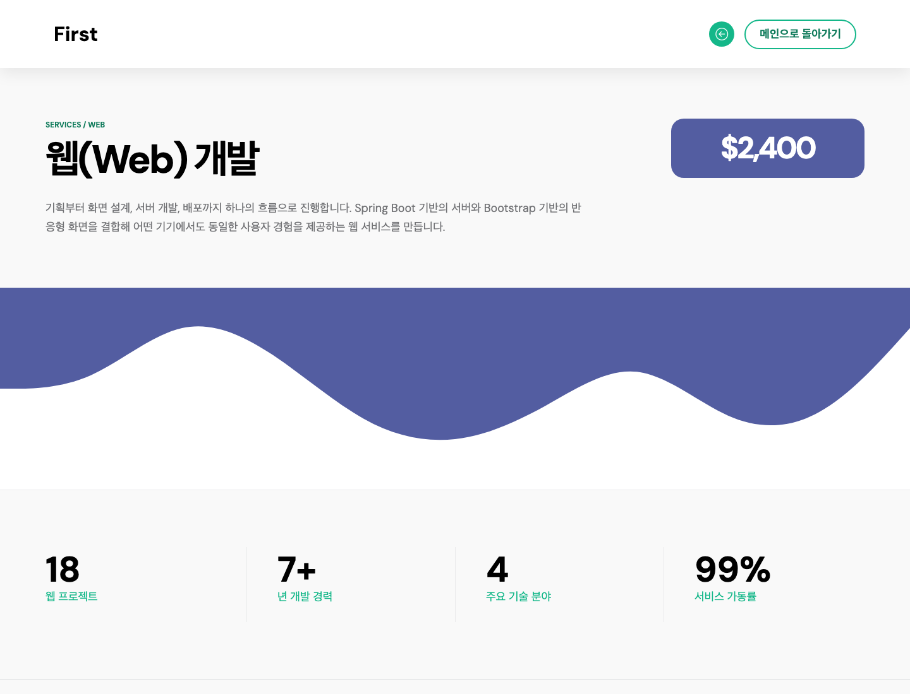
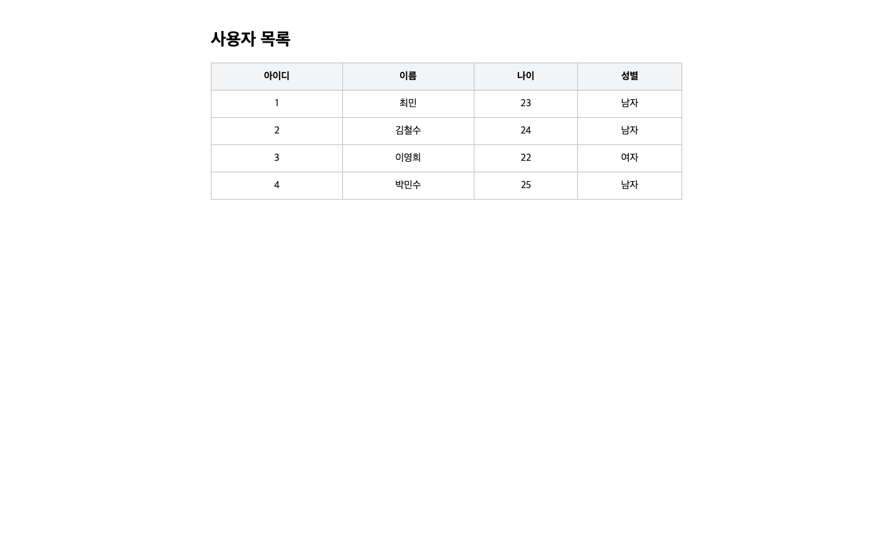
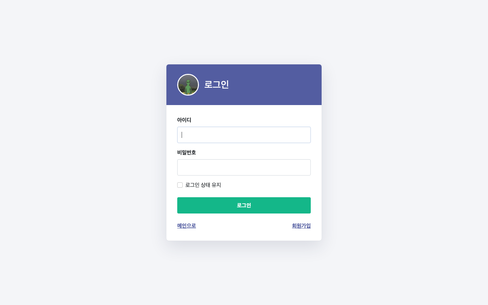
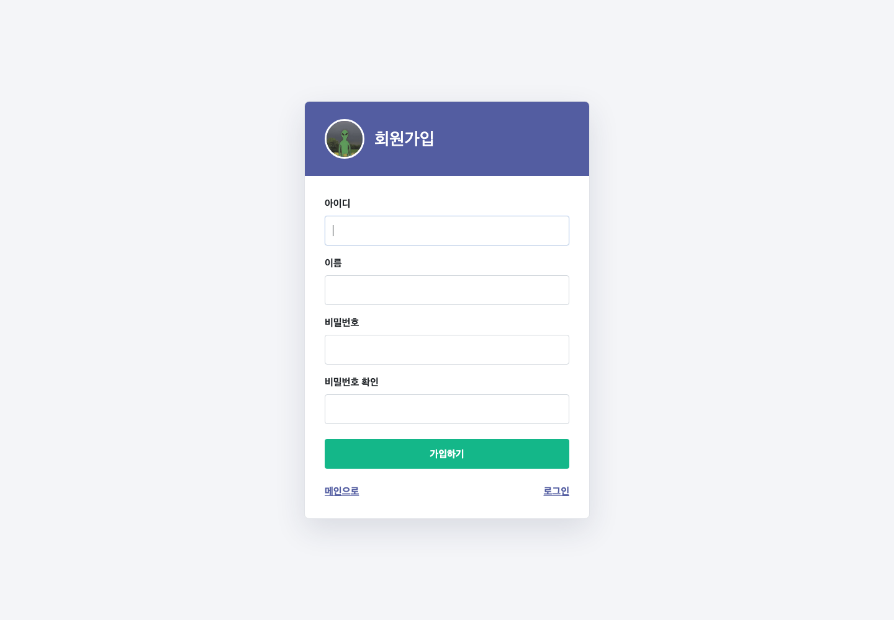

# 자바웹프로그래밍(2) 2주차 - 스프링 부트 개발환경 설정 및 테스트

VS Code에 스프링 부트 개발환경을 세팅하고 Thymeleaf로 첫 화면을 띄운 뒤 URL 맵핑과 컨트롤러까지 만들어 봤다. 강의 자료 순서를 그대로 따라가며 실습했고 마지막 연습문제도 풀어서 넣었다.

20231028 최민

## 개발 환경

| 항목 | 내용 |
|---|---|
| IDE | Visual Studio Code |
| 확장 | Extension Pack for Java, Spring Boot Extension Pack |
| 빌드 도구 | Maven |
| Spring Boot | 4.1.1 |
| Java | 21 (LTS) |
| 패키징 | Jar |
| 템플릿 엔진 | Thymeleaf 3.1.5 |
| WAS | 내장 Apache Tomcat 11, 8080 포트 |

강의 자료는 Java 25를 권장하지만 최소 요구 버전이 17이라 노트북에 이미 깔려 있던 21로 진행했다.

## 선택한 의존성

Spring Initializr에서 7가지를 골랐다. Spring Web, Thymeleaf, Spring Boot DevTools, Lombok, Spring Configuration Processor까지 다섯 개는 바로 쓰고 있고 Spring Data JPA와 MySQL Driver는 `pom.xml`에서 주석 처리해 뒀다.

DB를 아직 안 붙였는데 JPA가 살아 있으면 실행하자마자 데이터소스를 못 찾아서 죽는다. 강의 자료 17페이지에서 알려준 대로 해당 의존성 세 덩어리를 주석으로 막으니 8080 포트가 정상적으로 떴다. DB 실습에 들어가는 주차에 주석만 풀면 된다.

## 폴더 구조

```
src/
 └ main/
    ├ java/com/example/demo/
    │   ├ DemoApplication.java   # @SpringBootApplication, 프로그램 시작점
    │   └ DemoController.java    # URL 맵핑 컨트롤러
    └ resources/
       ├ templates/              # Thymeleaf 뷰
       │   ├ index.html          # 메인 페이지
       │   ├ hello.html          # /hello
       │   └ hello2.html         # /hello2, 연습문제
       ├ static/                 # css, js, images
       └ application.properties  # 포트, 캐시 설정
pom.xml                          # 빌드 및 종속성 설정
```

## 실행 방법

VS Code에서 `DemoApplication.java`를 열고 디버그 없이 실행(Ctrl + F5)하면 내장 톰캣이 뜬다. 터미널에서 직접 돌려도 된다.

```bash
./mvnw spring-boot:run
```

접속 주소는 셋이다.

- <http://localhost:8080/> 메인 페이지
- <http://localhost:8080/hello> 컨트롤러가 넘긴 값을 출력
- <http://localhost:8080/hello2> 연습문제 페이지

## 실습하면서 정리한 것

**index.html** — `resources/templates` 안에 만들었다. 기존 HTML5 문법을 그대로 쓰되 `<html>` 태그에 `xmlns:th`를 선언해야 Thymeleaf 문법이 먹는다. 처음에 링크를 `/hello.html`로 걸었더니 404가 났다. 파일 이름으로 직접 접근하는 방식이 아니라 컨트롤러가 매핑한 주소로 들어가야 해서였다. `/hello`로 고치니 연결됐다.

**DemoController.java** — `@Controller`를 붙이고 `@GetMapping("/hello")`으로 GET 요청을 받는다. `model.addAttribute("data", ...)`로 값을 담고 `"hello"`를 리턴하면 리턴한 이름과 같은 `hello.html`을 찾아서 렌더링한다. 파일 이름과 리턴값의 대소문자가 어긋나면 바로 에러가 나니 조심해야 한다.

**동작 순서** — 브라우저가 `/hello`를 요청하면 DispatcherServlet이 프론트 컨트롤러 역할로 받아서 컨트롤러에 넘긴다. 컨트롤러는 Model에 데이터를 담고 뷰 이름을 돌려준다. 그러면 Thymeleaf가 서버에서 HTML을 완성해 응답한다. MVC로 보면 Model은 페이지 정보, View는 Thymeleaf 화면, Controller는 흐름 제어를 맡는다.

## 연습문제

`/hello2` 맵핑을 새로 추가하고 속성 다섯 개를 출력했다.

컨트롤러의 `hello2()` 메서드에서 학과, 학번, 이름, 과목, 주차를 Model에 담고 `hello2.html`에서 `th:text="${...}"`로 하나씩 찍었다. `hello.html`의 링크도 `/hello2`로 바꿔서 메인에서 두 번째 페이지까지 클릭만으로 넘어간다.

실행해서 다섯 값이 전부 화면에 나오는지 확인했고 `./mvnw test`도 통과했다.

### 실습 결과

`/hello`의 링크를 눌러 `/hello2`로 넘어가는 흐름이다. 오른쪽 화면에 컨트롤러가 담은 다섯 속성이 그대로 찍혔다.

| `/hello` | `/hello2` |
|---|---|
|  |  |

---

# 자바웹프로그래밍(2) 3주차 - 포트폴리오 작성하기

TemplateMo 578 First Portfolio 원본 템플릿을 스프링 부트 프로젝트에 넣고, 웹/AI/보안/앱 기술 영역으로 수정했다. 강의 자료에서 안내한 것처럼 상세 페이지는 `resources/public` 폴더에 넣어서 컨트롤러를 새로 만들지 않고 바로 접근하게 했다.

20231028 최민

## 개발 환경

| 항목 | 내용 |
|---|---|
| IDE | Visual Studio Code |
| 빌드 도구 | Maven |
| Spring Boot | 4.1.1 |
| Java | 21 (LTS) |
| 템플릿 엔진 | Thymeleaf |
| 프론트엔드 | HTML, CSS, Bootstrap 5, Bootstrap Icons |
| 정적 페이지 위치 | `src/main/resources/public` |

가져온 `templatemo_578_first_portfolio.zip`에서 `css`, `js`, `images`, `fonts` 폴더를 `static`으로 옮기고 원본 `index.html`을 `templates`로 옮겼다. 제공된 `detailed_web.html` 소스를 기반으로 AI/보안/앱 상세 페이지도 추가했다. 기본 프로필 이미지는 `static/images/profile.png`에 넣고, 오른쪽 히어로 이미지는 `static/images/hero-monkey.png`로 따로 넣었다.

## 추가한 파일

```
src/
 └ main/
    └ resources/
       ├ templates/
       │   └ index.html                  # TemplateMo 원본 기반 포트폴리오 메인 화면
       ├ static/
       │   ├ css/                        # TemplateMo 원본 CSS
       │   ├ js/                         # TemplateMo 원본 JS
       │   ├ fonts/                      # Bootstrap Icons 폰트
       │   └ images/
       │      ├ profile.png              # 프로필 이미지
       │      ├ hero-monkey.png          # 오른쪽 히어로 이미지
       │      └ ...                      # TemplateMo 원본 이미지
       └ public/
          ├ detailed_web.html            # 웹 기술 상세 페이지
          ├ detailed_ai.html             # AI 기술 상세 페이지
          ├ detailed_security.html       # 보안 기술 상세 페이지
          └ detailed_app.html            # 앱 기술 상세 페이지
```

## 실행 방법

```bash
./mvnw spring-boot:run
```

접속 주소는 일곱 개다.

- <http://localhost:8080/> 메인 페이지
- <http://localhost:8080/hello> 2주차 Thymeleaf 예제
- <http://localhost:8080/hello2> 2주차 연습문제
- <http://localhost:8080/detailed_web.html> 3주차 웹 기술 상세 페이지
- <http://localhost:8080/detailed_ai.html> 3주차 AI 기술 상세 페이지
- <http://localhost:8080/detailed_security.html> 3주차 보안 기술 상세 페이지
- <http://localhost:8080/detailed_app.html> 3주차 앱 기술 상세 페이지

## 실습하면서 정리한 것

**포트폴리오 메인** - TemplateMo 578 원본 `index.html`을 기준으로 사용했다. 네비게이션 메뉴는 홈페이지, 소개, 기술, 프로젝트, 연락처로 한글화했고 각 메뉴는 `#section_1`부터 `#section_5`까지 같은 페이지 안에서 이동한다.

**프로필 이미지** - PDF에서 안내한 방식대로 초록 외계인 이미지를 `profile.png`로 준비해서 `static/images` 폴더에 넣었다. 메인 화면의 왼쪽 작은 프로필과 소개 영역 프로필은 `/images/profile.png`를 불러온다. 오른쪽 큰 히어로 이미지는 원숭이 사진인 `/images/hero-monkey.png`를 사용한다.

**기술 영역** - Services 영역을 기술 영역으로 보고 웹, AI, 보안, 앱 네 가지로 구성했다. 각 카드에는 Bootstrap Icons 아이콘과 간단한 설명, 상세 페이지로 이동하는 버튼을 넣었다.

**정적 페이지 위치** - `resources/public` 안에 넣은 파일은 컨트롤러 없이 바로 접근할 수 있다. 그래서 `/detailed_web.html`, `/detailed_ai.html`, `/detailed_security.html`, `/detailed_app.html` 요청은 `DemoController.java`에 `@GetMapping`을 추가하지 않아도 열린다.

**자원 경로** - HTML에서 CSS와 JS 경로가 맞지 않으면 화면은 열려도 디자인이 깨진다. 원본 템플릿의 `css`, `js`, `images`, `fonts`를 `static` 아래에 넣고 `/css/...`, `/js/...`, `/images/...`처럼 스프링 부트 정적 경로로 불러오게 했다.

**새 창 링크 보안** - 메인 페이지에서 상세 페이지를 새 창으로 열 때 `target="_blank"`와 함께 `rel="noopener noreferrer"`를 붙였다. 새 창이 원래 페이지를 조작하지 못하게 막고, 이전 페이지 주소 노출도 줄인다.

**Bootstrap 사용** - 그리드(`container`, `row`, `col-*`)로 화면을 나누고 카드, 버튼, 아이콘 클래스를 조합해서 반응형 상세 페이지를 만들었다. 모바일에서는 열이 자동으로 아래로 내려가서 작은 화면에서도 읽기 좋다.

## 연습문제

가져온 `detailed_web.html`을 `public` 폴더에 넣고, 같은 형식을 재활용해 `detailed_ai.html`, `detailed_security.html`, `detailed_app.html`도 추가했다.

강의 자료의 핵심은 포트폴리오 화면을 스프링 부트 프로젝트 안에 넣고, 웹/AI/보안/앱 같은 기술 영역별 상세 페이지를 구성하는 것이다. 메인 페이지의 각 기술 카드에서 상세 페이지가 새 창으로 열리도록 `target="_blank"`와 `rel="noopener noreferrer"`를 함께 사용했다.

### 실습 결과

메인 포트폴리오에서 TemplateMo 원본 레이아웃이 적용되고, 기술 카드의 웹 상세 페이지도 정상적으로 열린다.

| 메인 포트폴리오 | 웹 상세 페이지 |
|---|---|
|  |  |

## 성능 확인 - 원인 분석

Lighthouse 보고서를 PC와 모바일 조건으로 각각 생성했다. 결과 파일은 `docs/lighthouse/desktop.json`, `docs/lighthouse/mobile.json`에 저장했다.

| 구분 | Performance | Accessibility | Best Practices | SEO |
|---|---:|---:|---:|---:|
| PC | 96 | 90 | 100 | 91 |
| Mobile | 69 | 92 | 100 | 91 |

모바일 점수가 더 낮은 이유는 Lighthouse 모바일 검사가 느린 네트워크와 낮은 CPU 성능을 가정하기 때문이다. 같은 페이지라도 모바일 조건에서는 이미지 표시와 JavaScript 실행 시간이 더 길게 잡혀 LCP와 TTI가 크게 늘어난다.

가장 성능을 감소시키는 항목 2개는 다음과 같다.

1. **사용하지 않는 CSS** - Bootstrap 전체 CSS, Bootstrap Icons, TemplateMo CSS를 한 번에 불러오므로 실제 화면에서 쓰지 않는 CSS가 많이 남는다. 모바일 기준 약 223KB 절감 가능으로 표시됐다.
2. **사용하지 않는 JavaScript** - Bootstrap JS와 jQuery를 원본 템플릿 그대로 불러오지만 첫 화면에서 전부 필요하지는 않다. 모바일 기준 약 85KB 절감 가능으로 표시됐다.

추가로 favicon 404 오류를 없애고, 프로필 이미지를 압축해서 모바일 LCP를 줄였다. 다만 원본 TemplateMo 모양을 유지해야 하므로 CSS/JS를 잘라내는 최적화는 이번 과제 범위에서는 적용하지 않았다.

---

# 자바웹프로그래밍(2) 4주차 - 데이터베이스 연동 및 테스트

MySQL과 Spring Data JPA를 연결하고 프로젝트를 Controller, Service, Repository, Domain 계층으로 나눴다. `testdb` 테이블을 엔티티로 만들고 데이터 전체 조회까지 구현한 뒤, 연습문제의 나이와 성별 컬럼도 추가해서 화면에 출력했다.

20231028 최민

## 개발 환경

| 항목 | 내용 |
|---|---|
| Spring Boot | 4.1.1 |
| Java | 21 (LTS) |
| 데이터베이스 | MySQL 8.0.46 |
| ORM | Spring Data JPA, Hibernate |
| 커넥션 풀 | HikariCP |
| 템플릿 엔진 | Thymeleaf |

`pom.xml`에서 2주차에 주석 처리했던 Spring Data JPA와 MySQL Connector/J 의존성을 활성화했다. MySQL에는 `spring` 데이터베이스를 만들었고, `application.properties`에 JDBC 주소와 JPA 설정을 추가했다. 비밀번호는 GitHub에 올라가지 않도록 `DB_PASSWORD` 환경변수로 받는다.

## 폴더 구조

```
src/main/
 ├ java/com/example/demo/
 │  ├ DemoApplication.java
 │  ├ controller/
 │  │  └ DemoController.java       # 요청 처리와 Model 전달
 │  └ model/
 │     ├ domain/
 │     │  └ TestDB.java            # testdb 테이블과 연결되는 엔티티
 │     ├ repository/
 │     │  └ TestRepository.java    # JpaRepository 기반 DB 접근
 │     └ service/
 │        └ TestService.java       # 사용자 조회 로직
 └ resources/
    ├ templates/
    │  └ testdb.html               # 사용자 목록 화면
    └ application.properties       # MySQL/JPA 연결 설정
docs/
 └ sql/
    └ week4-users.sql              # 실습용 사용자 INSERT 문
```

기존 `DemoController.java`는 `controller` 패키지로 옮겼다. 화면 파일은 기존처럼 `templates`에 두고, 데이터 구조는 `domain`, DB 접근은 `repository`, 중간 처리는 `service`로 분리했다.

## 데이터베이스 설정 및 실행 방법

MySQL에서 데이터베이스를 먼저 만든다.

```sql
CREATE DATABASE spring;
FLUSH PRIVILEGES;
```

애플리케이션을 한 번 실행하면 `spring.jpa.hibernate.ddl-auto=update` 설정에 따라 `testdb` 테이블이 자동 생성된다. 그다음 실습 데이터를 입력한다.

```bash
mysql -u root -p spring < docs/sql/week4-users.sql
```

비밀번호를 환경변수로 전달해서 스프링 부트를 실행한다.

```bash
DB_PASSWORD='본인 MySQL 비밀번호' ./mvnw spring-boot:run
```

접속 주소는 <http://localhost:8080/testdb>이다.

## 실습하면서 정리한 것

**JPA와 엔티티** - `@Entity`가 붙은 `TestDB` 클래스를 JPA가 관리하고, `@Table(name = "testdb")`로 MySQL 테이블과 연결한다. `id`는 기본키이며 `GenerationType.IDENTITY`를 사용해 MySQL이 값을 자동 증가시킨다.

**Repository** - `TestRepository`가 `JpaRepository<TestDB, Long>`을 상속하므로 SQL을 직접 작성하지 않아도 `findAll()`, `findById()`, `save()`, `delete()` 같은 기본 메서드를 사용할 수 있다. 이름 한 명을 찾는 `findByName()`은 메서드 이름을 바탕으로 JPA가 쿼리를 만든다.

**Service와 의존성 주입** - `TestService`에서 Repository를 주입받아 이름 조회와 전체 조회를 처리한다. 생성자 주입을 사용해서 필요한 의존성이 빠지지 않도록 했다.

**Controller와 Thymeleaf** - `/testdb` 요청이 들어오면 Service의 `findAll()` 결과를 `users`라는 이름으로 Model에 담는다. `testdb.html`은 `th:each`로 목록을 반복하면서 아이디, 이름, 나이, 성별을 표로 출력한다.

**연결 확인** - 실행 로그에서 `HikariPool-1 - Start completed`와 MySQL 8.0.46 연결 정보를 확인했다. Hibernate가 `testdb` 테이블을 자동 생성했고 `./mvnw test`도 정상 통과했다.

## 연습문제

기존 엔티티에는 `name`만 있었지만 연습문제에 맞춰 `age`와 `gender` 필드를 추가했다. Hibernate가 두 컬럼을 테이블에 반영한 뒤 `week4-users.sql`의 INSERT 문으로 사용자 4명을 저장했다.

최민의 정보는 이름 `최민`, 나이 `23`, 성별 `남자`로 입력했다. Thymeleaf 표에도 두 컬럼을 추가해서 모든 사용자 정보가 한 화면에 출력되도록 했다.

### 실습 결과

`/testdb`에서 MySQL에 저장된 사용자 네 명의 아이디, 이름, 나이, 성별이 모두 표시된다.



---

# 자바웹프로그래밍(2) 5주차 - 로그인, 로그아웃 및 암호화

Spring Security를 추가해 세션 기반 로그인과 로그아웃을 구현하고, 회원가입 비밀번호를 BCrypt 해시로 저장했다. 로그인하지 않은 사용자는 회원목록에 접근할 수 없으며, 연습문제의 7일 로그인 상태 유지와 비밀번호 확인 검증까지 적용했다.

20231028 최민

## 개발 환경

| 항목 | 내용 |
|---|---|
| Spring Boot | 4.1.1 |
| Java | 21 (LTS) |
| Spring Security | 7.1.1 |
| 데이터베이스 | MySQL 8.0.46 |
| 암호화 | BCryptPasswordEncoder |
| 화면 | Thymeleaf, Thymeleaf Spring Security Extras |

`pom.xml`에 Spring Security와 Thymeleaf Security Extras를 추가했다. 로그인 정보는 서버 세션에 저장되고 브라우저는 `JSESSIONID` 쿠키로 세션을 구분한다. 로그인 상태 유지를 선택하면 유효기간이 7일인 `remember-me` 쿠키도 발급된다.

## 추가한 구조

```
src/main/
 ├ java/com/example/demo/
 │  ├ config/
 │  │  └ SecurityConfig.java       # URL 권한, 로그인, 로그아웃, remember-me
 │  ├ controller/
 │  │  └ MemberController.java     # 로그인·회원가입 화면과 가입 처리
 │  └ model/
 │     ├ domain/
 │     │  └ Member.java            # member 테이블 엔티티
 │     ├ dto/
 │     │  └ MemberForm.java        # 회원가입 입력값
 │     ├ repository/
 │     │  └ MemberRepository.java  # 아이디 조회와 중복 확인
 │     └ service/
 │        └ MemberService.java      # 입력 검증, BCrypt 암호화, 로그인 조회
 └ resources/
    ├ static/css/auth.css           # 로그인·회원가입 공통 스타일
    ├ templates/login.html          # 로그인 화면
    ├ templates/signup.html         # 회원가입 화면
    └ application-secret.properties # DB 비밀번호와 보안 키, Git 제외
```

`Member` 엔티티와 화면 입력용 `MemberForm` DTO를 분리했다. 화면에는 `role` 필드가 없고 서버가 항상 `USER`로 저장하므로 사용자가 가입 요청에서 관리자 권한을 임의로 보낼 수 없다.

## 보안 설정

`SecurityConfig`에서 메인, 로그인, 회원가입, 상세 페이지와 정적 파일은 누구나 접근할 수 있게 했다. `/testdb`를 포함한 나머지 주소는 인증된 사용자만 접근할 수 있다.

- 로그인 성공: 메인 화면으로 이동
- 로그인 실패: `/login?error`
- 로그아웃: CSRF 보호가 적용되는 `POST /logout`
- 로그아웃 성공: `/login?logout`
- remember-me: 7일 유지
- 비밀번호: BCrypt 단방향 해시 저장

메인 네비게이션은 로그인 전에는 로그인 버튼을, 로그인 후에는 `아이디님`과 로그아웃 버튼을 보여준다. 메뉴가 20px인 상태에서도 잘리지 않도록 1400px 미만 화면에서는 햄버거 메뉴로 전환되게 했다.

## 비밀 설정 및 실행 방법

`src/main/resources/application-secret.properties`는 `.gitignore`에 등록되어 GitHub에 올라가지 않는다. 처음 실행할 때 아래 형식으로 직접 만든다.

```properties
spring.datasource.username=root
spring.datasource.password=본인_MySQL_비밀번호
app.security.remember-me-key=충분히_긴_임의의_문자열
```

그다음 스프링 부트를 실행한다.

```bash
./mvnw spring-boot:run
```

접속 주소는 다음과 같다.

- <http://localhost:8080/login> 로그인
- <http://localhost:8080/signup> 회원가입
- <http://localhost:8080/testdb> 로그인 후 접근 가능한 회원목록

## 실습하면서 정리한 것

**SecurityFilterChain** - 요청이 컨트롤러에 도착하기 전에 보안 필터가 인증 여부와 접근 권한을 확인한다. 허용하지 않은 페이지를 비로그인 상태로 요청하면 직접 만든 `/login` 화면으로 이동한다.

**회원가입과 DTO** - `MemberForm`에는 아이디, 이름, 비밀번호, 비밀번호 확인만 있다. DB 전용 필드인 기본키와 권한은 화면에서 받지 않고 서버가 관리한다.

**BCrypt 암호화** - 회원가입 때 `PasswordEncoder.encode()`로 비밀번호를 암호화한다. 테스트 계정의 DB 값을 확인한 결과 `$2a$`로 시작하는 60자 해시였고 입력한 평문과 달랐다. 로그인할 때는 Spring Security가 `matches()`로 자동 비교한다.

**UserDetailsService** - `MemberService`가 `UserDetailsService`를 구현해 아이디로 회원을 찾는다. 사용자가 없으면 `UsernameNotFoundException`을 발생시키고, 회원이 있으면 암호화된 비밀번호와 `USER` 권한을 Security 사용자 객체로 변환한다.

**CSRF와 로그아웃** - 로그인, 회원가입, 로그아웃 폼에 `th:action`을 사용해 CSRF 토큰이 자동으로 들어간다. 로그아웃은 GET 링크가 아니라 POST 폼으로 처리하고 세션과 인증 쿠키를 삭제한다.

## 연습문제

### 로그인 상태 유지

로그인 화면에 `remember-me` 체크박스를 연결하고 `SecurityConfig`의 유효기간을 `7 * 24 * 60 * 60`초로 설정했다. 실제 로그인 응답에서 `remember-me` 쿠키의 `Max-Age=604800`, `HttpOnly` 속성을 확인했다. 보안 키는 공개 설정에 넣지 않고 Git에서 제외된 secret 파일로 분리했다.

### 비밀번호 확인 검증

`MemberService.signup()`에서 비밀번호와 비밀번호 확인 값을 비교한다. 다르면 `비밀번호가 일치하지 않습니다.`를 화면에 출력하고 Repository의 `save()`를 호출하지 않는다. 빈 값, 6자 미만 비밀번호, 50자를 넘는 아이디와 이름도 서버에서 거부한다.

자동 테스트로 불일치 비밀번호가 저장되지 않는 경우와 정상 비밀번호가 BCrypt 해시로 바뀌는 경우를 확인했다. 전체 `./mvnw test` 결과는 3개 테스트 모두 성공이다.

### 실습 결과

기존 포트폴리오의 프로필 이미지와 색상을 사용해 로그인과 회원가입 화면을 구성했다. 브라우저에서 가입 실패, 정상 가입, 로그인, 회원목록 접근, 로그아웃, 로그아웃 후 접근 차단까지 순서대로 확인했다.

| 로그인 화면 | 회원가입 화면 |
|---|---|
|  |  |
